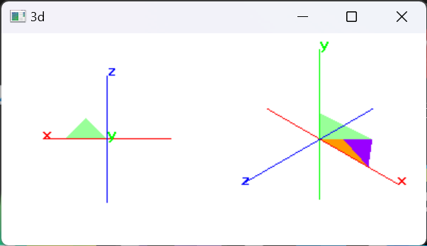
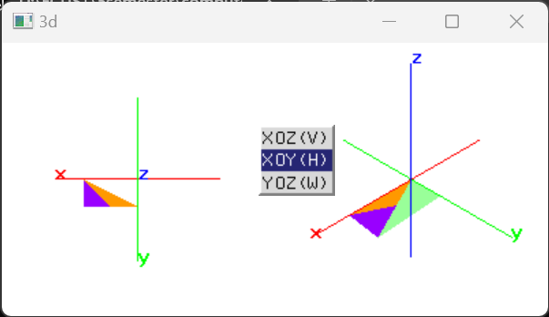
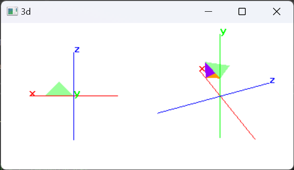
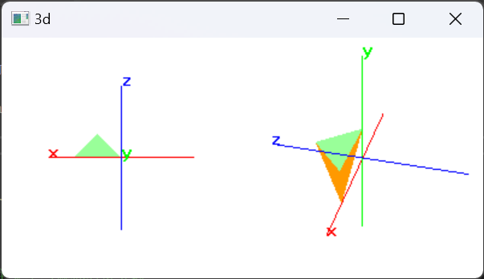

# simple-opengl-3d-tool

✨**基于 C++(MSVC) 和 OpenGL 的正交投影和透视投影的实现**✨ 3维视角，透视，投影。定义三维透视观察可视体，交互控制照相机的位置，透视观察四面体📌包含可执行文件，环境配置指南。

[个人网站：www.bytesc.top](http://www.bytesc.top) 

[个人博客：blog.bytesc.top](http://blog.bytesc.top)

🔔 如有项目相关问题，欢迎在本项目提出`issue`，我一般会在 24 小时内回复。

### 源代码

`C++` 源代码文件。如果在 `visual studio 2022` 以外的其它 `OpenGL` 环境运行，使用以下代码文件即可。
```txt
│  simple-opengl-3d-tool.exe.cpp   # 主要源代码文件，项目入口
│  getAxis.h
│  getTetrahedron.h
│  setLookAt.h
```

## 页面展示


右键菜单项分别为`XOZ(V)`、`XOY(H)`和`YOZ(W)`，对应着不同的视图



利用键盘`x`、`y`、`z`，控制右视区的照相机的三维旋转角度




## 运行环境

运行环境
- `windows 11`
- `Visual Studio 2022`
- `OpenGL`
    * `glfw-3.3.8.bin.WIN64`
    * `glutdlls37beta`

### 不配置环境

如果仅运行可执行文件，不修改和调试，无需配置环境。

可执行文件在项目目录下的 `x64/debug/simple-opengl-3d-tool.exe` 鼠标双击即可。

### 环境配置

配置方法参考这篇我转载的知乎文章 [VS2022的openGL环境搭建（完整篇）](https://zhuanlan.zhihu.com/p/486459964)

`Visual Studio 2022` 配置 `OpenGL` 所需相关资源和指南（转载非原创）在 `conf` 文件夹内。

## 项目结构

### 文件目录
```txt
│  .gitignore
│  getAxis.h
│  getTetrahedron.h
│  LICENSE
│  packages.config
│  README.md
│  setLookAt.h
│  simple-opengl-3d-tool.cpp  # 源码入口
│  simple-opengl-3d-tool.sln  # vs项目入口
│  simple-opengl-3d-tool.vcxproj
│  simple-opengl-3d-tool.vcxproj.filters
│  simple-opengl-3d-tool.vcxproj.user
│
├─conf
├─packages
├─readme_img
└─x64
    ├─Debug
    │  │  freeglut.dll
    │  │  glew32.dll
    │  │  glewinfo.exe
    │  │  glfw3.dll
    │  │  simple-opengl-3d-tool.exe  # 可执行文件入口
    │  │  simple-opengl-3d-tool.exe.recipe
    │  │  simple-opengl-3d-tool.ilk
    │  │  simple-opengl-3d-tool.log
    │  │  simple-opengl-3d-tool.obj
    │  │  simple-opengl-3d-tool.pdb
    │  │  simple-opengl-3d-tool.vcxproj.FileListAbsolute.txt
    │  │  vc143.idb
    │  │  vc143.pdb
    │  │  visualinfo.exe
    │  │
    │  └─simple-o.6acf5f88.tlog
    │          CL.command.1.tlog
    │          CL.read.1.tlog
    │          CL.write.1.tlog
    │          link.command.1.tlog
    │          link.read.1.tlog
    │          link.write.1.tlog
    │          simple-opengl-3d-tool.lastbuildstate
    │
    └─Release
        │  freeglut.dll
        │  glew32.dll
        │  glewinfo.exe
        │  glfw3.dll
        │  simple-opengl-3d-tool.exe
        │  simple-opengl-3d-tool.exe.recipe
        │  simple-opengl-3d-tool.iobj
        │  simple-opengl-3d-tool.ipdb
        │  simple-opengl-3d-tool.log
        │  simple-opengl-3d-tool.obj
        │  simple-opengl-3d-tool.pdb
        │  simple-opengl-3d-tool.vcxproj.FileListAbsolute.txt
        │  vc143.pdb
        │  visualinfo.exe
        │
        └─simple-o.6acf5f88.tlog
                CL.command.1.tlog
                CL.read.1.tlog
                CL.write.1.tlog
                link.command.1.tlog
                link.read.1.tlog
                link.write.1.tlog
                link.write.2u.tlog
                simple-opengl-3d-tool.lastbuildstate
```

### 源代码

`C++` 源代码文件。如果在 `visual studio 2022` 以外的其它 `OpenGL` 环境运行，使用以下代码文件即可。
```txt
│  simple-opengl-3d-tool.exe.cpp   # 主要源代码文件，项目入口
│  getAxis.h
│  getTetrahedron.h
│  setLookAt.h
```

## 运行方法

### 运行
运行可执行文件无需配置环境，鼠标双击打开 `x64/debug/simple-opengl-3d-tool.exe`

### 调试
先按照上文配置环境，然后用 `Visual Studio 2022` 打开 `simple-opengl-3d-tool.sln`，源码文件为 `simple-opengl-3d-tool.cpp`


# 开源许可证

此翻译版本仅供参考，以 LICENSE 文件中的英文版本为准

MIT 开源许可证：

版权所有 (c) 2023 bytesc

特此授权，免费向任何获得本软件及相关文档文件（以下简称“软件”）副本的人提供使用、复制、修改、合并、出版、发行、再许可和/或销售软件的权利，但须遵守以下条件：

上述版权声明和本许可声明应包含在所有副本或实质性部分中。

本软件按“原样”提供，不作任何明示或暗示的保证，包括但不限于适销性、特定用途适用性和非侵权性。在任何情况下，作者或版权持有人均不对因使用本软件而产生的任何索赔、损害或其他责任负责，无论是在合同、侵权或其他方面。